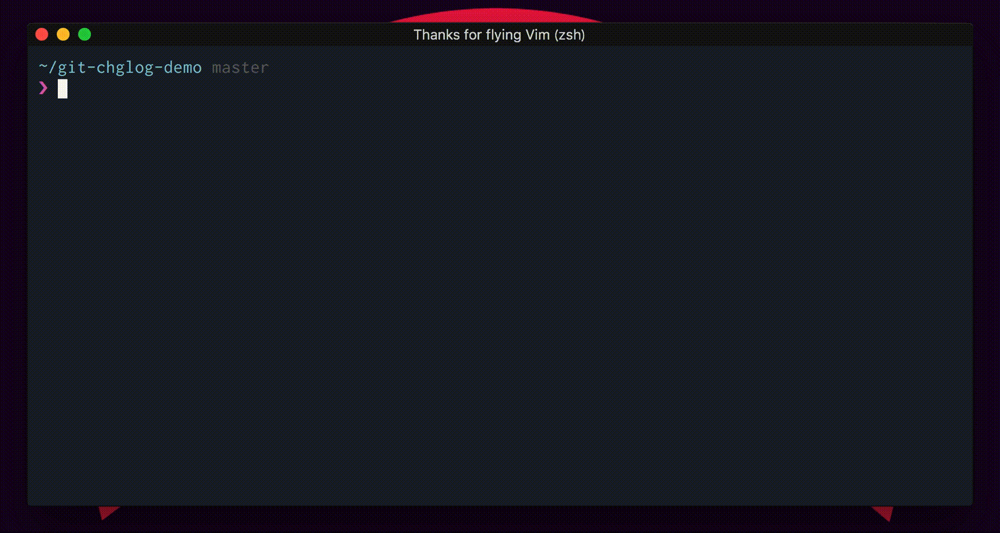

# git-chglog


[](https://godoc.org/github.com/git-chglog/git-chglog)
[](https://github.com/git-chglog/git-chglog/actions)
[](https://coveralls.io/github/git-chglog/git-chglog?branch=master)
[](https://github.com/git-chglog/git-chglog/blob/master/LICENSE)

> CHANGELOG generator implemented in Go (Golang).
> _Anytime, anywhere, Write your CHANGELOG._

## Table of Contents

- [git-chglog](#git-chglog)
  - [Table of Contents](#table-of-contents)
  - [Features](#features)
  - [How it works](#how-it-works)
  - [Getting Started](#getting-started)
    - [Installation](#installation)
      - [Homebrew (for macOS users)](#homebrew-for-macos-users)
      - [Scoop (for Windows users)](#scoop-for-windows-users)
      - [asdf](#asdf)
      - [Go users](#go-users)
    - [Docker](#docker)
    - [Test Installation](#test-installation)
    - [Quick Start](#quick-start)
  - [CLI Usage](#cli-usage)
    - [`tag query`](#tag-query)
  - [Configuration](#configuration)
    - [`bin`](#bin)
    - [`style`](#style)
    - [`template`](#template)
    - [`info`](#info)
    - [`options`](#options)
      - [`options.sort`](#optionssort)
      - [`options.commits`](#optionscommits)
      - [`options.commit_groups`](#optionscommit_groups)
      - [`options.header`](#optionsheader)
      - [`options.issues`](#optionsissues)
      - [`options.refs`](#optionsrefs)
      - [`options.merges`](#optionsmerges)
      - [`options.reverts`](#optionsreverts)
      - [`options.notes`](#optionsnotes)
  - [Templates](#templates)
  - [Supported Styles](#supported-styles)
  - [Jira Integration](#jira-integration)
    - [1. Change the header parse pattern to recognize Jira issue id in the configure file](#1-change-the-header-parse-pattern-to-recognize-jira-issue-id-in-the-configure-file)
    - [2. Add Jira configuration to the configure file](#2-add-jira-configuration-to-the-configure-file)
    - [3. Update the template to show Jira data](#3-update-the-template-to-show-jira-data)
  - [FAQ](#faq)
  - [TODO](#todo)
  - [Thanks](#thanks)
  - [Contributing](#contributing)
  - [Development](#development)
  - [Release Process](#release-process)
  - [Feedback](#feedback)
  - [CHANGELOG](#changelog)
  - [Related Projects](#related-projects)
  - [License](#license)

## Features

- :recycle: High portability
  - It works with single binary. Therefore, any project (environment) can be used.
- :beginner: Simple usability
  - The CLI usage is very simple and has low learning costs.
  - For example, the simplest command is `$ git-chglog`.
- :rocket: High flexibility
  - Commit message format and ...
  - CHANGELOG's style (Template) and ...
  - etc ...

## How it works

`git-chglog` internally uses the `git` command to get data to include in the
CHANGELOG. The basic steps are as follows.

1. Get all the tags.
1. Get the commits contained between `tagA` and `tagB`.
1. Execute with all tags corresponding to [tag query](#tag-query) that were specified in Step 1 and 2.

## Getting Started

We will start with installation and introduce the steps up to the automatic generation
of the configuration file and template.

### Installation

Please install `git-chglog` in a way that matches your environment.

#### [Homebrew](https://brew.sh) (for macOS users)

```bash
brew tap git-chglog/git-chglog
brew install git-chglog
```

#### [Scoop](https://scoop.sh) (for Windows users)

```bash
scoop install git-chglog
```

#### [asdf](https://asdf-vm.com/)

```bash
asdf plugin-add git-chglog https://github.com/GoodwayGroup/asdf-git-chglog.git
asdf install git-chglog latest
```

#### Go users

```bash
go install github.com/git-chglog/git-chglog/cmd/git-chglog@latest
```

### [Docker](https://www.docker.com/)
The compiled docker images are maintained on [quay.io](https://quay.io/repository/git-chglog/git-chglog). 
We maintain the following tags:
- `edge`: Image that is build from the current `HEAD` of the main line branch.
- `latest`: Image that is built from the [latest released version](https://github.com/git-chglog/git-chglog/releases)
- `x.y.y` (versions): Images that are build from the tagged versions within Github.
```bash
docker pull quay.io/git-chglog/git-chglog:latest
docker run -v "$PWD":/workdir quay.io/git-chglog/git-chglog --version
```
---

If you are using another platform, you can download a binary from the [releases page]
and place it in a directory in your `$PATH`.

### Test Installation

You can check with the following command whether the `git-chglog` command was
included in a directory that is in your `$PATH`.

```bash
$ git-chglog --version
# outputs the git-chglog version
```

### Quick Start

`git-chglog` requires configuration files and templates to generate a CHANGELOG.

However, it is a waste of time to create configuration files and templates from scratch.

Therefore we recommend using the `--init` option which will create them interactively :+1:

```bash
git-chglog --init
```



---

You are now ready for configuration files and templates!

Let's immediately generate a CHANGELOG of your project.
By doing the following simple command, Markdown for your CHANGELOG is displayed
on stdout.

```bash
git-chglog
```

Use `-o` (`--output`) option if you want to output to a file instead of stdout.

```bash
git-chglog -o CHANGELOG.md
```

---

You now know basic usage of `git-chglog`!

In order to make a better CHANGELOG, please refer to the following document and
customize it.

## CLI Usage

```bash
$ git-chglog --help

USAGE:
  git-chglog [options] <tag query>

    There are the following specification methods for <tag query>.

    1. <old>..<new> - Commit contained in <old> tags from <new>.
    2. <name>..     - Commit from the <name> to the latest tag.
    3. ..<name>     - Commit from the oldest tag to <name>.
    4. <name>       - Commit contained in <name>.

OPTIONS:
  --init                      generate the git-chglog configuration file in interactive (default: false)
  --path value                Filter commits by path(s). Can use multiple times.
  --config value, -c value    specifies a different configuration file to pick up (default: ".chglog/config.yml")
  --template value, -t value  specifies a template file to pick up. If not specified, use the one in config
  --repository-url value      specifies git repo URL. If not specified, use 'repository_url' in config
  --output value, -o value    output path and filename for the changelogs. If not specified, output to stdout
  --next-tag value            treat unreleased commits as specified tags (EXPERIMENTAL)
  --silent                    disable stdout output (default: false)
  --no-color                  disable color output (default: false) [$NO_COLOR]
  --no-emoji                  disable emoji output (default: false) [$NO_EMOJI]
  --no-case                   disable case sensitive filters (default: false)
  --tag-filter-pattern value  Regular expression of tag filter. Is specified, only matched tags will be picked
  --jira-url value            Jira URL [$JIRA_URL]
  --jira-username value       Jira username [$JIRA_USERNAME]
  --jira-token value          Jira token [$JIRA_TOKEN]
  --sort value                Specify how to sort tags; currently supports "date" or by "semver" (default: date)
  --help, -h                  show help (default: false)
  --version, -v               print the version (default: false)

EXAMPLE:

  $ git-chglog

    If <tag query> is not specified, it corresponds to all tags.
    This is the simplest example.

  $ git-chglog 1.0.0..2.0.0

    The above is a command to generate CHANGELOG including commit of 1.0.0 to 2.0.0.

  $ git-chglog 1.0.0

    The above is a command to generate CHANGELOG including commit of only 1.0.0.

  $ git-chglog $(git describe --tags $(git rev-list --tags --max-count=1))

    The above is a command to generate CHANGELOG with the commit included in the latest tag.

  $ git-chglog --output CHANGELOG.md

    The above is a command to output to CHANGELOG.md instead of standard output.

  $ git-chglog --config custom/dir/config.yml

    The above is a command that uses a configuration file placed other than ".chglog/config.yml".

  $ git-chglog --path path/to/my/component --output CHANGELOG.component.md

    Filter commits by specific paths or files in git and output to a component specific changelog.
```

### `tag query`

You can specify which commits to include in the generation of CHANGELOG using `<tag query>`.

The table below shows Query patterns and summaries, and Query examples.

| Query          | Description                                    | Example                     |
|:---------------|:-----------------------------------------------|:----------------------------|
| `<old>..<new>` | Commit contained in `<new>` tags from `<old>`. | `$ git-chglog 1.0.0..2.0.0` |
| `<name>..`     | Commit from the `<name>` to the latest tag.    | `$ git-chglog 1.0.0..`      |
| `..<name>`     | Commit from the oldest tag to `<name>`.        | `$ git-chglog ..2.0.0`      |
| `<name>`       | Commit contained in `<name>`.                  | `$ git-chglog 1.0.0`        |

## Configuration

The `git-chglog` configuration is a yaml file. The default location is
`.chglog/config.yml`.

Below is a complete list that you can use with `git-chglog`.

```yaml
bin: git
style: ""
template: CHANGELOG.tpl.md
info:
  title: CHANGELOG
  repository_url: https://github.com/git-chglog/git-chglog

options:
  tag_filter_pattern: '^v'
  sort: "date"

  commits:
    filters:
      Type:
        - feat
    sort_by: Scope

  commit_groups:
    group_by: Type
    sort_by: Title
    title_order:
      - feat
    title_maps:
      feat: Features

  header:
    pattern: "<regexp>"
    pattern_maps:
      - PropName

  issues:
    prefix:
      - #

  refs:
    actions:
      - Closes
      - Fixes

  merges:
    pattern: "^Merge branch '(\\w+)'$"
    pattern_maps:
      - Source

  reverts:
    pattern: "^Revert \"([\\s\\S]*)\"$"
    pattern_maps:
      - Header

  notes:
    keywords:
      - BREAKING CHANGE
```

### `bin`

Git execution command.

| Required | Type   | Default | Description |
|:---------|:-------|:--------|:------------|
| N        | String | `"git"` | -           |

### `style`

CHANGELOG style. Automatic linking of issues and notices, initial value setting
such as merges etc. are done automatically.

| Required | Type   | Default  | Description                                            |
|:---------|:-------|:---------|:-------------------------------------------------------|
| N        | String | `"none"` | Should be `"github"` `"gitlab"` `"bitbucket"` `"none"` |

### `template`

Path for the template file. It is specified by a relative path from the setting
file. Absolute paths are also ok.

| Required | Type   | Default              | Description |
|:---------|:-------|:---------------------|:------------|
| N        | String | `"CHANGELOG.tpl.md"` | -           |

### `info`

Metadata for CHANGELOG. Depending on Style, it is sometimes used in processing,
so it is recommended to specify it.

| Key              | Required | Type   | Default       | Description            |
|:-----------------|:---------|:-------|:--------------|:-----------------------|
| `title`          | N        | String | `"CHANGELOG"` | Title of CHANGELOG.    |
| `repository_url` | N        | String | none          | URL of git repository. |

### `options`

Options used to process commits.

#### `options.sort`

Options concerning the acquisition and sort of commits.

| Required | Type        | Default   | Description                                                                                                         |
|:---------|:------------|:----------|:--------------------------------------------------------------------------------------------------------------------|
| N        | String      | `"date"` | Defines how tags are sorted in the generated change log. Values: "date", "semver". |

#### `options.commits`

Options concerning the acquisition and sort of commits.

| Key       | Required | Type        | Default   | Description                                                                                         |
|:----------|:---------|:------------|:----------|:----------------------------------------------------------------------------------------------------|
| `filters` | N        | Map in List | none      | Filter by using `Commit` properties and values. Filtering is not done by specifying an empty value. |
| `sort_by` | N        | String      | `"Scope"` | Property name to use for sorting `Commit`. See [Commit].                                            |

#### `options.commit_groups`

Options for groups of commits.

| Key           | Required | Type        | Default   | Description                                                                                |
|:--------------|:---------|:------------|:----------|:-------------------------------------------------------------------------------------------|
| `group_by`    | N        | String      | `"Type"`  | Property name of `Commit` to be grouped into `CommitGroup`. See [CommitGroup][doc-commit]. |
| `sort_by`     | N        | String      | `"Title"` | Property name to use for sorting `CommitGroup`. See [CommitGroup][doc-commit-group].       |
| `title_order` | N        | List        | none      | Predefined order of titles to use for sorting `CommitGroup`. Only if `sort_by` is `Custom` |
| `title_maps`  | N        | Map in List | none      | Map for `CommitGroup` title conversion.                                                    |

#### `options.header`

This option is used for parsing the commit header.

| Key            | Required | Type   | Default | Description                                                                                             |
|:---------------|:---------|:-------|:--------|:--------------------------------------------------------------------------------------------------------|
| `pattern`      | Y        | String | none    | A regular expression to use for parsing the commit header.                                              |
| `pattern_maps` | Y        | List   | none    | A rule for mapping the result of `HeaderPattern` to the property of `Commit`. See [Commit][doc-commit]. |

#### `options.issues`

This option is used to detect issues.

| Key      | Required | Type | Default | Description                                |
|:---------|:---------|:-----|:--------|:-------------------------------------------|
| `prefix` | N        | List | none    | Prefix used for issues. (e.g. `#`, `#gh-`) |

#### `options.refs`

This option is for parsing references.

| Key       | Required | Type | Default | Description                                    |
|:----------|:---------|:-----|:--------|:-----------------------------------------------|
| `actions` | N        | List | none    | Word list of `Ref.Action`. See [Ref][doc-ref]. |

#### `options.merges`

Options to detect and parse merge commits.

| Key            | Required | Type   | Default | Description                               |
|:---------------|:---------|:-------|:--------|:------------------------------------------|
| `pattern`      | N        | String | none    | Similar to `options.header.pattern`.      |
| `pattern_maps` | N        | List   | none    | Similar to `options.header.pattern_maps`. |

#### `options.reverts`

Options to detect and parse revert commits.

| Key            | Required | Type   | Default | Description                               |
|:---------------|:---------|:-------|:--------|:------------------------------------------|
| `pattern`      | N        | String | none    | Similar to `options.header.pattern`.      |
| `pattern_maps` | N        | List   | none    | Similar to `options.header.pattern_maps`. |

#### `options.notes`

Options to detect notes contained in commit bodies.

| Key        | Required | Type | Default | Description                                                                                          |
|:-----------|:---------|:-----|:--------|:-----------------------------------------------------------------------------------------------------|
| `keywords` | N        | List | none    | Keyword list to find `Note`. A semicolon is a separator, like `<keyword>:` (e.g. `BREAKING CHANGE`). |

## Templates

The `git-chglog` template uses the `text/template` package and enhanced templating functions provided by [Sprig]. For basic usage please refer to the following.

- [text/template](https://golang.org/pkg/text/template/)
- [Sprig]

We have implemented the following custom template functions. These override functions provided by [Sprig].

| Name         | Signature                                     | Description                                                                   |
| :----------- | :-------------------------------------------- | :---------------------------------------------------------------------------- |
| `contains`   | `func(s, substr string) bool`                 | Reports whether `substr` is within `s` using `strings.Contains`               |
| `datetime`   | `func(layout string, input time.Time) string` | Generate a formatted Date string based on layout                              |
| `hasPrefix`  | `func(s, prefix string) bool`                 | Tests whether the string `s` begins with `prefix` using `strings.HasPrefix`   |
| `hasSuffix`  | `func(s, suffix string) bool`                 | Tests whether the string `s` ends with `suffix`. using `strings.HasPrefix`    |
| `indent`     | `func(s string, n int) string`                | Indent all lines of `s` by `n` spaces                                         |
| `replace`    | `func(s, old, new string, n int) string`      | Replace `old` with `new` within string `s`, `n` times using `strings.Replace` |
| `upperFirst` | `func(s string) string`                       | Upper case the first character of a string                                    |

If you are not satisfied with the prepared template please try customizing one.

---

The basic templates are as follows.

**Example:**

```markdown
{{ if .Versions -}}
<a name="unreleased"></a>
## [Unreleased]

{{ if .Unreleased.CommitGroups -}}
{{ range .Unreleased.CommitGroups -}}
### {{ .Title }}
{{ range .Commits -}}
- {{ if .Scope }}**{{ .Scope }}:** {{ end }}{{ .Subject }}
{{ end }}
{{ end -}}
{{ end -}}
{{ end -}}

{{ range .Versions }}
<a name="{{ .Tag.Name }}"></a>
## {{ if .Tag.Previous }}[{{ .Tag.Name }}]{{ else }}{{ .Tag.Name }}{{ end }} - {{ datetime "2006-01-02" .Tag.Date }}
{{ range .CommitGroups -}}
### {{ .Title }}
{{ range .Commits -}}
- {{ if .Scope }}**{{ .Scope }}:** {{ end }}{{ .Subject }}
{{ end }}
{{ end -}}

{{- if .RevertCommits -}}
### Reverts
{{ range .RevertCommits -}}
- {{ .Revert.Header }}
{{ end }}
{{ end -}}

{{- if .MergeCommits -}}
### Pull Requests
{{ range .MergeCommits -}}
- {{ .Header }}
{{ end }}
{{ end -}}

{{- if .NoteGroups -}}
{{ range .NoteGroups -}}
### {{ .Title }}
{{ range .Notes }}
{{ .Body }}
{{ end }}
{{ end -}}
{{ end -}}
{{ end -}}

{{- if .Versions }}
[Unreleased]: {{ .Info.RepositoryURL }}/compare/{{ $latest := index .Versions 0 }}{{ $latest.Tag.Name }}...HEAD
{{ range .Versions -}}
{{ if .Tag.Previous -}}
[{{ .Tag.Name }}]: {{ $.Info.RepositoryURL }}/compare/{{ .Tag.Previous.Name }}...{{ .Tag.Name }}
{{ end -}}
{{ end -}}
{{ end -}}
```

See the godoc [RenderData][doc-render-data] documentation for available variables.

## Supported Styles

| Name                                       | Status             | Features                                               |
|:-------------------------------------------|:-------------------|:-------------------------------------------------------|
| [GitHub](https://github.com/)              | :white_check_mark: | Mentions automatic link. Automatic link to references. |
| [GitLab](https://about.gitlab.com/)        | :white_check_mark: | Mentions automatic link. Automatic link to references. |
| [Bitbucket](https://bitbucket.org/product) | :white_check_mark: | Mentions automatic link. Automatic link to references. |

> :memo: Even with styles that are not yet supported, it is possible to make
ordinary CHANGELOG.

## Jira Integration

Jira is a popular project management tool. When a project uses Jira to track
feature development and bug fixes, it may also want to generate change log based
information stored in Jira. With embedding a Jira story id in git commit header,
the git-chglog tool may automatically fetch data of the story from Jira, those
data then can be used to render the template.

Take the following steps to add Jira integration:

### 1. Change the header parse pattern to recognize Jira issue id in the configure file

__Where Jira issue is identical Jira story.__

The following is a sample pattern:

  ```yaml
  header:
    pattern: "^(?:(\\w*)|(?:\\[(.*)\\])?)\\:\\s(.*)$"
    pattern_maps:
      - Type
      - JiraIssueID
      - Subject
  ```

This sample pattern can match both forms of commit headers:

- `feat: new feature of something`
- `[JIRA-ID]: something`

### 2. Add Jira configuration to the configure file

The following is a sample:

  ```yaml
  jira:
    info:
      username: u
      token: p
      url: https://jira.com
    issue:
      type_maps:
        Task: fix
        Story: feat
      description_pattern: "<changelog>(.*)</changelog>"
  ```

Here you need to define Jira URL, access username and token (password). If you
don't want to write your Jira access credential in configure file, you may define
them with environment variables: `JIRA_URL`, `JIRA_USERNAME` and `JIRA_TOKEN`.

You also needs to define a issue type map. In above sample, Jira issue type `Task`
will be mapped to `fix` and `Story` will be mapped to `feat`.

As a Jira story's description could be very long, you might not want to include
the entire description into change log. In that case, you may define `description_pattern`
like above, so that only content embraced with `<changelog> ... </changelog>`
will be included.

### 3. Update the template to show Jira data

In the template, if a commit contains a Jira issue id, then you may show Jira
data. For example:

```markdown
{{ range .CommitGroups -}}
### {{ .Title }}
{{ range .Commits -}}
- {{ if .Scope }}**{{ .Scope }}:** {{ end }}{{ .Subject }}
{{ if .JiraIssue }} {{ .JiraIssue.Description }}
{{ end }}
{{ end }}
{{ end -}}
```

Within a `Commit`, the following Jira data can be used in template:

- `.JiraIssue.Summary` - Summary of the Jira story
- `.JiraIssue.Description` - Description of the Jira story
- `.JiraIssue.Type` - Original type of the Jira story, and `.Type` will be mapped type.
- `.JiraIssue.Labels` - A list of strings, each is a Jira label.

## FAQ

<details>
  <summary>Why do not you output files by default?</summary>
  This is not for the purpose of completely automating the generation of CHANGELOG
  files, it is only for assisting generation.

  It is ideal to describe everything included in CHANGELOG in your commits. But
  actually it is very difficult to do it perfectly.

  There are times when you need to edit the generated output to write a great CHANGELOG.

  By displaying it on the standard output, it makes it easy to change the contents.
</details>

<details>
  <summary>Can I commit CHANGELOG changes before creating tags?</summary>

  Yes, it can be solved by using the `--next-tag` flag.

  For example, let's say you want to upgrade your project to `2.0.0`.
  You can create CHANGELOG containing `2.0.0` as follows.

  ```bash
  git-chglog --next-tag 2.0.0 -o CHANGELOG.md
  git commit -am "release 2.0.0"
  git tag 2.0.0
  ```

  The point to notice is that before actually creating a tag with `git`, it is
  conveying the next version with `--next-tag` :+1:

  This is a step that is necessary for project operation in many cases.
</details>

<details>
  <summary>Can I generate a CHANGELOG based on certain tags?</summary>

  Yes, it can be solved by use the `--tag-filter-pattern` flag.

  For example, the following command will only include tags starting with "v":

  ```bash
  git-chglog --tag-filter-pattern '^v'
  ```

</details>

## TODO

- [x] Windows Support
- [x] More styles (GitHub, GitLab, Bitbucket :tada:)
- [ ] Snippetization of configuration files (improvement of reusability)
- [ ] More test test test ... (and example)

## Thanks

`git-chglog` is inspired by [conventional-changelog]. Thank you!

## Contributing

We always welcome your contributions :clap:

## Development

1. Use Golang version `>= 1.19`
1. Fork (https://github.com/git-chglog/git-chglog) :tada:
1. Create a feature branch :coffee:
1. Run test suite with the `$ make test` command and confirm that it passes :zap:
1. Run linters with the `$ make lint` command and confirm it passes :broom:
   - The project uses [golangci-lint]
1. Commit your changes :memo:
1. Rebase your local changes against the `master` branch :bulb:
1. Create new Pull Request :love_letter:

Bugs, feature requests and comments are more than welcome in the [issues].

## Release Process

There is a `release` target within the Makefile that wraps up the steps to
release a new version.

> NOTE: Pass the `VERSION` variable when running the command to properly set
> the tag version for the release.

```bash
$ VERSION=vX.Y.Z make release
# EXAMPLE:
$ VERSION=v0.11.3 make release
```

Once the `tag` has been pushed, the `goreleaser` github action will take care
of the rest.

## Feedback

I would like to make `git-chglog` a better tool.
The goal is to be able to use in various projects.

Therefore, your feedback is very useful.
I am very happy to tell you your opinions on Issues and PR :heart:

## CHANGELOG

See [CHANGELOG.md](./CHANGELOG.md)

## Related Projects

- [git-chglog/artwork] - Assets for `git-chglog`.

## License

[MIT © tsuyoshiwada](./LICENSE)

[releases page]: https://github.com/git-chglog/git-chglog/releases
[Commit]: https://godoc.org/github.com/git-chglog/git-chglog#Commit
[doc-commit]: https://godoc.org/github.com/git-chglog/git-chglog#Commit
[doc-commit-group]: https://godoc.org/github.com/git-chglog/git-chglog#CommitGroup
[doc-ref]: https://godoc.org/github.com/git-chglog/git-chglog#Ref
[doc-render-data]: https://godoc.org/github.com/git-chglog/git-chglog#RenderData
[conventional-changelog]: https://github.com/conventional-changelog/conventional-changelog
[golangci-lint]: https://golangci-lint.run/usage/install/#local-installation
[issues]: https://github.com/git-chglog/git-chglog/issues
[git-chglog/artwork]: https://github.com/git-chglog/artwork
[Sprig]: http://masterminds.github.io/sprig
